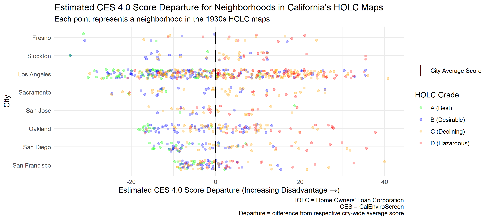

# Pollution & Prejudice - Data Analysis Summary

<!-- summary_report.md is generated from summary_report.qmd - edit that file -->

## Background

Placeholder text.

### Intent / Purpose

- Analyze present-day pollution burden / vulnerability in neighborhoods
  that were assessed in the 1930s HOLC maps in California cities, and
  analyze trends by HOLC grade (to see if HOLC grade is a possible
  predictor of present day environmental conditions)

- Assess present-day demographics of neighborhoods assessed in the 1930s
  HOLC maps in California cities, and assess whether the distribution of
  racial / ethnic groups differs by HOLC grade (to see if those areas
  are still segregated by HOLC grade today)

### Data Sources

- CalEnviroScreen (includes 2019 5-year ACS data)
- HOLC (Redline) Maps

## Process Overview

Estimate CES scores and present-day racial / ethnic makeup for each
neighborhood in the 1930s HOLC maps in California, using an area
weighted average of CES scores / demographic data for census tracts that
overlap each HOLC neighborhood

[Figure 1](#fig-map-process) illustrates the process for estimating CES
Scores.

- Panel 1 (left) shows the HOLC neighborhoods and their respective HOLC
  grades
- Panel 2 shows the outline of the HOLC neighborhoods, overlaid on top
  of the CalEnviroScreen scores (by census tract)
- Panel 3 shows the intersection of the HOLC neighborhoods and the
  CalEnviroScreen scores
- Panel 4 (right) shows the estimated / computed CalEnviroScreen score
  for each HOLC neighborhood, based on an area weighted average of the
  CalEnviroScreen scores for the census tracts that overlap with each
  HOLC neighborhood

## Results - CalEnviroScreen Scores

### Raw Scores

[Figure 2](#fig-scores-raw) shows the estimated CES score for each
neighborhood in the 1930s HOLC maps.

### Average Scores by HOLC Grade

[Figure 3](#fig-scores-avg-by-grade) shows the average of the estimated
CES scores for each HOLC grade (A through D) within each city.

### Adjusted (Departure) Scores

[Figure 4](#fig-scores-departure) shows how we standardize the scores to
allow for comparisons across cities.

- Calculate a “departure” score for each HOLC neighborhood, which is the
  difference between (1) the estimated CES score for that neighborhood
  and (2) the average of the estimated CES scores for all HOLC
  neighborhoods in that same city.
- Essentially, this centers the average estimated CES score for all
  cities at zero, and makes comparisons across cities possible
  (otherwise, regional differences in the factors that CES measures
  would overwhelm any differences between HOLC grades)
- A positive departure score means the CES score for that HOLC
  neighborhood is above the average for its city, whereas a negative
  score means the CES score is below the average for its city.

### Adjusted (Departure) Scores - Boxplot

[Figure 5](#fig-boxplot) shows a boxplot of the departure scores, which
helps to illustrate the scale of the differences in estimated CES scores
between the HOLC grades.

## Results - Demographics

[Figure 6](#fig-demographics-race) shows the estimated present-day
distribution of racial/ethnic groups across HOLC grades (for the
population living within neighborhoods in California cities that were
included in the 1930s HOLC maps).

## Comparison of Alternative Methods for Estimating CES Scores

To test the sensitivity of the estimated CES scores to the method used
to compute the scores, we also estimated the overall CES score for each
HOLC neighborhood using an alternative method - nearest centroid
matching - and compared the results to those obtained from our original
area weighted average method. This nearest centroid approach finds the
CES census tract (excluding tracts without CES scores) whose centriod is
closest to the centroid of each HOLC neighborhood, and assigns the CES
score of the matched census tract to that HOLC neighborhood. If the
results from the two methods are substantially the same, we can infer
that the estimated CES scores are not highly sensitive to different
calculation methods, and therefore have greater confidence in our
estimated CES scores.

[Figure 7](#fig-score-method-comparison) shows how the CES scores
estimated for each HOLC neighborhood using the two methods compare
across all HOLC grades.

[Figure 8](#fig-score-method-comparison-facet) shows how the CES scores
estimated for each HOLC neighborhood using the two methods compare for
each of the four HOLC grades individually.

## Summary of HOLC Neighborhoods with Missing CES Scores

Some census tracts are not assigned a score for individual CES 4.0
indicators, or an overall CES 4.0 score. Of the 8035 total census tracts
contained the in CES dataset, there are 103 tracts with missing overall
CES scores, and varying numbers of tracts with missing scores for
individual indicators - this includes 23 tracts with zero population.

Because some census tracts that are not assigned a CES score overlap
with some HOLC neighborhoods, a minimum coverage threshold (as a percent
of each HOLC neighborhood area covered by CES tracts with scores) is
applied to determine which HOLC neighborhoods to assign CES scores to. A
HOLC neighborhood is only assigned a CES score if the area covered by
CES tracts with scores exceeds the minimum coverage threshold;
otherwise, the HOLC neighborhood is assigned a NA (i.e., missing) value.

In our analysis, we use a minimum coverage threshold of 0.5. Using this
threshold, there are 3 HOLC neighborhoods which fall below the
threshold, and are not assigned a CES 4.0 score (i.e., they are given an
`NA` value).

[Table 1](#tbl-missing-scores) provides a summary of the number of HOLC
neighborhoods with missing CES scores by CES measure and HOLC grade.

| ces_measure                                   | holc_grade | n_missing | n_total | pct_missing |
|:----------------------------------------------|:-----------|----------:|--------:|:------------|
| calenviroscreen_4_0_score                     | B          |         1 |     273 | 0.37%       |
| calenviroscreen_4_0_score                     | C          |         2 |     331 | 0.60%       |
| drinking_water_score                          | B          |         1 |     273 | 0.37%       |
| education_score                               | B          |         1 |     273 | 0.37%       |
| education_score                               | C          |         1 |     331 | 0.30%       |
| housing_burden_score                          | B          |         1 |     273 | 0.37%       |
| housing_burden_score                          | C          |         2 |     331 | 0.60%       |
| lead_score                                    | B          |         1 |     273 | 0.37%       |
| lead_score                                    | C          |         2 |     331 | 0.60%       |
| linguistic_isolation_score                    | B          |         5 |     273 | 1.83%       |
| linguistic_isolation_score                    | C          |        14 |     331 | 4.23%       |
| linguistic_isolation_score                    | D          |         1 |     155 | 0.65%       |
| low_birth_weight_score                        | B          |         1 |     273 | 0.37%       |
| low_birth_weight_score                        | C          |         3 |     331 | 0.91%       |
| population_characteristics_group_score        | B          |         1 |     273 | 0.37%       |
| population_characteristics_group_score        | C          |         2 |     331 | 0.60%       |
| population_characteristics_group_score_scaled | B          |         1 |     273 | 0.37%       |
| population_characteristics_group_score_scaled | C          |         2 |     331 | 0.60%       |
| poverty_score                                 | B          |         1 |     273 | 0.37%       |
| poverty_score                                 | C          |         1 |     331 | 0.30%       |
| traffic_score                                 | B          |         1 |     273 | 0.37%       |
| unemployment_score                            | A          |         3 |     109 | 2.75%       |
| unemployment_score                            | B          |         8 |     273 | 2.93%       |
| unemployment_score                            | C          |         7 |     331 | 2.11%       |
| unemployment_score                            | D          |         1 |     155 | 0.65%       |

Table 1: Summary of missing HOLC neighborhoods which are not assigned
CES scores.

