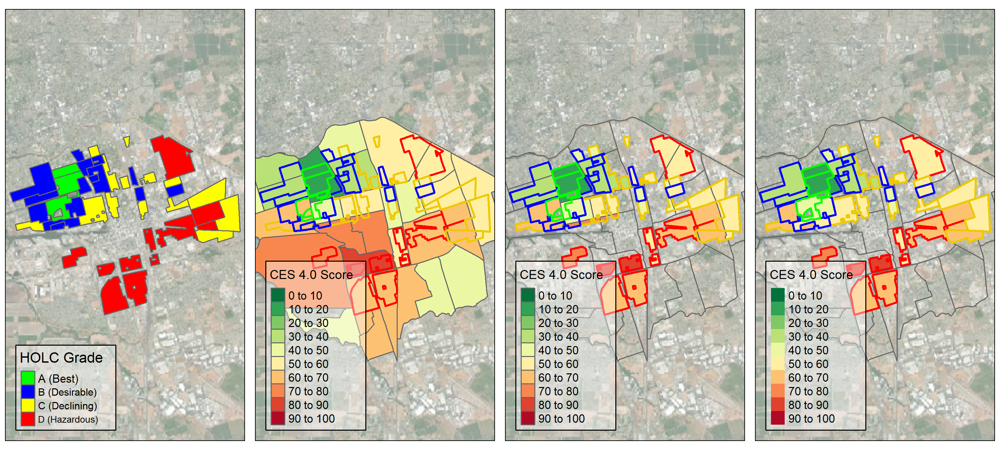
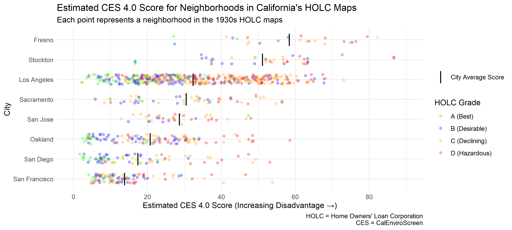
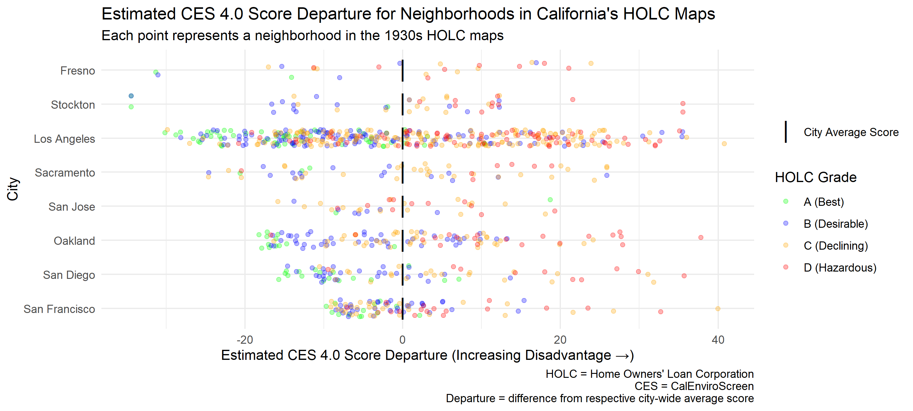
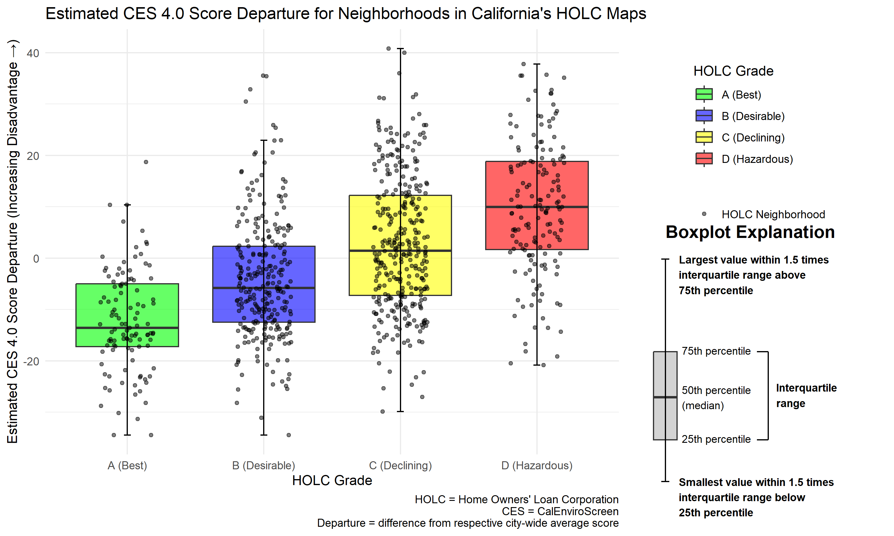
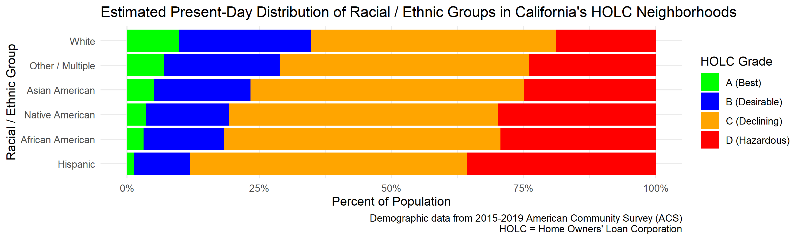

# Pollution & Prejudice - Data Analysis Summary

## Background

Placeholder text.

### Intent / Purpose

- Analyze present-day pollution burden / vulnerability in neighborhoods
  that were assessed in the 1930s HOLC maps in California cities, and
  analyze trends by HOLC grade (to see if HOLC grade is a possible
  predictor of present day environmental conditions)

- Assess present-day demographics of neighborhoods assessed in the 1930s
  HOLC maps in California cities, and assess whether the distribution of
  racial / ethnic groups differs by HOLC grade (to see if those areas
  are still segregated by HOLC grade today)

### Data Sources

- CalEnviroScreen (includes 2019 5-year ACS data)
- HOLC (Redline) Maps

## Process Overview

Estimate CES scores and present-day racial / ethnic makeup for each
neighborhood in the 1930s HOLC maps in California, using an area
weighted average of CES scores / demographic data for census tracts that
overlap each HOLC neighborhood

[Figure 1](#fig-map-process) illustrates the process for estimating CES
Scores.

- Panel 1 (left) shows the HOLC neighborhoods and their respective HOLC
  grades
- Panel 2 shows the outline of the HOLC neighborhoods, overlaid on top
  of the CalEnviroScreen scores (by census tract)
- Panel 3 shows the intersection of the HOLC neighborhoods and the
  CalEnviroScreen scores
- Panel 4 (right) shows the estimated / computed CalEnviroScreen score
  for each HOLC neighborhood, based on an area weighted average of the
  CalEnviroScreen scores for the census tracts that overlap with each
  HOLC neighborhood

## Results - CalEnviroScreen Scores

### Raw Scores

[Figure 2](#fig-scores-raw) shows the estimated CES score for each
neighborhood in the 1930s HOLC maps.

### Average Scores by HOLC Grade

[Figure 3](#fig-scores-avg-by-grade) shows the average of the estimated
CES scores for each HOLC grade (A through D) within each city.

### Adjusted (Departure) Scores

[Figure 4](#fig-scores-departure) shows how we standardize the scores to
allow for comparisons across cities.

- Calculate a “departure” score for each HOLC neighborhood, which is the
  difference between (1) the estimated CES score for that neighborhood
  and (2) the average of the estimated CES scores for all HOLC
  neighborhoods in that same city.
- Essentially, this centers the average estimated CES score for all
  cities at zero, and makes comparisons across cities possible
  (otherwise, regional differences in the factors that CES measures
  would overwhelm any differences between HOLC grades)
- A positive departure score means the CES score for that HOLC
  neighborhood is above the average for its city, whereas a negative
  score means the CES score is below the average for its city.

### Adjusted (Departure) Scores - Boxplot

[Figure 5](#fig-boxplot) shows a boxplot of the departure scores, which
helps to illustrate the scale of the differences in estimated CES scores
between the HOLC grades.

## Results - Demographics

[Figure 6](#fig-demographics-race) shows the estimated present-day
distribution of racial/ethnic groups across HOLC grades (for the
population living within neighborhoods in California cities that were
included in the 1930s HOLC maps).

